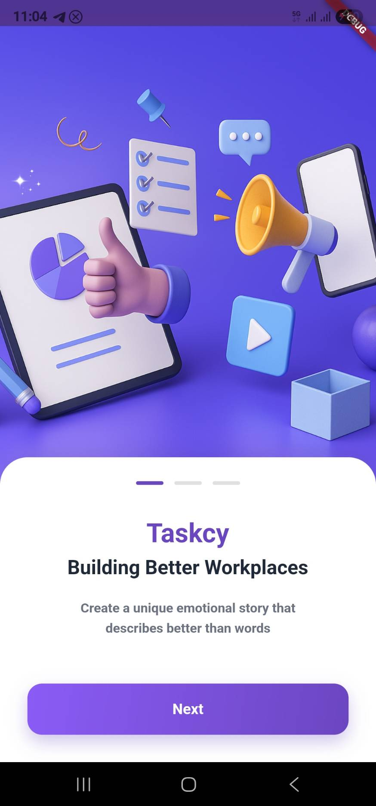
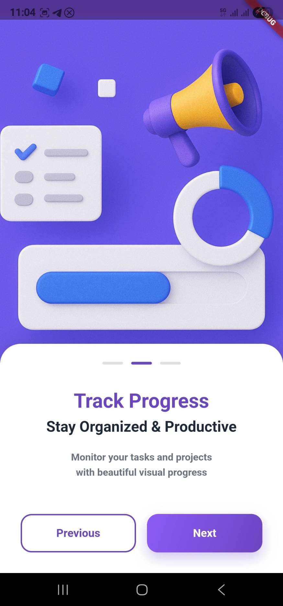

# 🚀 Taskcy - Task Tracker App

<div align="center">


*A modern, intuitive task management application built with Flutter*

[Features](#-features) • [Screenshots](#-screenshots) • [Getting Started](#-getting-started) • [Installation](#-installation) • [Usage](#-usage) • [Architecture](#-architecture) • [Contributing](#-contributing)

</div>

---

## ✨ Features

### 🎯 Core Functionality
- **Task Management**: Create, edit, and organize tasks with ease
- **Team Collaboration**: Assign tasks to team members and track progress
- **Time Tracking**: Set start and end times for better time management
- **Status Boards**: Organize tasks by status (Urgent, Ongoing, Running)
- **Date Scheduling**: Plan tasks with flexible date selection

### 🎨 User Experience
- **Beautiful Onboarding**: Engaging introduction with animated slides
- **Modern UI/UX**: Clean, intuitive interface with purple gradient theme
- **Responsive Design**: Optimized for various screen sizes
- **Smooth Animations**: Fluid transitions and micro-interactions
- **Form Validation**: Real-time validation with helpful error messages

### 👥 Team Features
- **Member Selection**: Visual team member picker with avatars
- **Role Assignment**: Assign tasks to specific team members
- **Progress Tracking**: Monitor task completion status
- **Collaborative Workflow**: Streamlined team coordination

---

## 📱 Preview & Screenshots

<div align="center">

### App Preview
<div style="display: flex; justify-content: center; gap: 10px; flex-wrap: wrap;">
  
  
  
</div>

<div style="display: flex; justify-content: center; gap: 10px; flex-wrap: wrap; margin-top: 10px;">
  
  
</div>

### Key Features Showcase


</div>

---

## 🚀 Getting Started

### Prerequisites

Before you begin, ensure you have the following installed:
- [Flutter](https://flutter.dev/docs/get-started/install) (3.0 or higher)
- [Dart](https://dart.dev/get-dart) (2.19 or higher)
- [Android Studio](https://developer.android.com/studio) or [VS Code](https://code.visualstudio.com/)
- [Git](https://git-scm.com/)

### System Requirements
- **Android**: API level 21 or higher
- **iOS**: iOS 11.0 or higher
- **macOS**: 10.14 or higher (for development)

---

## 📦 Installation

1. **Clone the repository**
   ```bash
   git clone https://github.com/yourusername/task_tracker_app.git
   cd task_tracker_app
   ```

2. **Install dependencies**
   ```bash
   flutter pub get
   ```

3. **Run the app**
   ```bash
   flutter run
   ```

### Build for Production

**Android APK:**
```bash
flutter build apk --release
```

**iOS:**
```bash
flutter build ios --release
```

---

## 🎯 Usage

### Getting Started with Taskcy

1. **Launch the App**: Open Taskcy on your device
2. **Onboarding**: Swipe through the introduction slides
3. **Create Tasks**: Tap "Get Started" to begin task management
4. **Add Team Members**: Select team members for task assignment
5. **Set Schedule**: Choose dates and times for your tasks
6. **Organize**: Use status boards to categorize your work

### Key Features Walkthrough

#### 📝 Creating a Task
- Enter task name and description
- Select team members from the visual picker
- Choose date and time constraints
- Assign to appropriate status board

#### 👥 Team Management
- View team member avatars
- Select multiple members for collaboration
- Track individual contributions
- Monitor team progress

#### ⏰ Time Management
- Set specific start and end times
- Plan tasks within 14-day windows
- Optimize your daily schedule
- Track time allocation

---

## 🏗️ Architecture

### Project Structure
```
lib/
├── main.dart                 # App entry point
├── view/
│   ├── landing_page.dart     # Onboarding experience
│   ├── add_task_page.dart    # Task creation interface
│   └── task_page.dart        # Task management (placeholder)
└── assets/
    └── images/               # App images and icons
```

### Dependencies
- **Flutter**: Core framework
- **dots_indicator**: Onboarding pagination
- **cupertino_icons**: iOS-style icons

### Key Components

#### Landing Page (`landing_page.dart`)
- Animated onboarding slides
- Gradient background design
- Interactive navigation
- Smooth page transitions

#### Add Task Page (`add_task_page.dart`)
- Form validation system
- Date/time pickers
- Team member selection
- Status board organization

---

## 🎨 Design System

### Color Palette
- **Primary**: `#6B46C1` (Purple)
- **Secondary**: `#8B5CF6` (Light Purple)
- **Background**: White with gradient overlays
- **Text**: Dark gray (`#1F2937`) and medium gray (`#6B7280`)

### Typography
- **Headings**: Bold, 24-32px
- **Body Text**: Regular, 16px
- **Labels**: Medium weight, 16px
- **Captions**: Light weight, 12px

### Components
- **Buttons**: Rounded corners (12px radius)
- **Cards**: White background with subtle shadows
- **Input Fields**: Bordered with focus states
- **Avatars**: Circular with selection indicators

---

## 🔧 Development

### Running Tests
```bash
flutter test
```

### Code Analysis
```bash
flutter analyze
```

### Formatting
```bash
flutter format lib/
```

### Linting
The project uses `flutter_lints` for code quality. Configuration is in `analysis_options.yaml`.

---

## 🤝 Contributing

We welcome contributions! Please follow these steps:

1. **Fork the repository**
2. **Create a feature branch**
   ```bash
   git checkout -b feature/amazing-feature
   ```
3. **Make your changes**
4. **Run tests and linting**
   ```bash
   flutter test
   flutter analyze
   ```
5. **Commit your changes**
   ```bash
   git commit -m 'Add amazing feature'
   ```
6. **Push to the branch**
   ```bash
   git push origin feature/amazing-feature
   ```
7. **Open a Pull Request**

### Contribution Guidelines
- Follow Flutter best practices
- Add tests for new features
- Update documentation as needed
- Use conventional commit messages

---

## 📄 License

This project is licensed under the MIT License - see the [LICENSE](LICENSE) file for details.

---

## 🙏 Acknowledgments

- **Flutter Team**: For the amazing framework
- **Design Inspiration**: Modern UI/UX patterns
- **Community**: For feedback and suggestions

---

## 📞 Support

- **Issues**: [GitHub Issues](https://github.com/yourusername/task_tracker_app/issues)
- **Discussions**: [GitHub Discussions](https://github.com/yourusername/task_tracker_app/discussions)
- **Email**: support@taskcy.app

---

<div align="center">

**Made with ❤️ using Flutter**

[](https://flutter.dev)
[](https://dart.dev)

</div>
